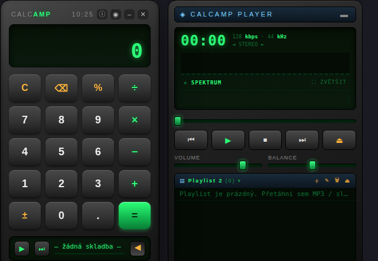
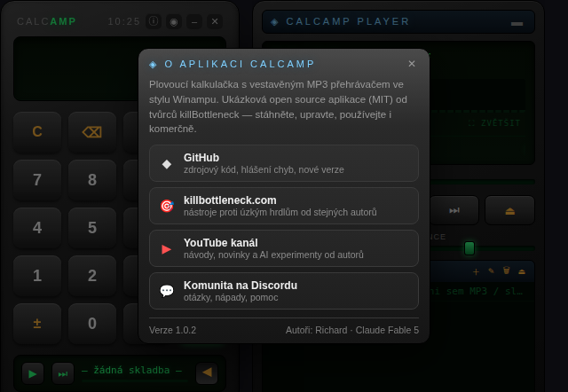

# CalcAmp

*Čtete raději česky? → [README.cs.md](README.cs.md)*

A floating, translucent **calculator** with a built-in **Winamp-style MP3 player**.
Built on Electron — one codebase for **Linux, Windows and macOS**.



The window is frameless and translucent. At first glance it is just a calculator —
the `▶` arrow in the bottom bar expands a full music player next to it, complete
with a real-time visualizer.

## Features

**Calculator**
- Full mouse and keyboard input (digits, `+ - * /`, `Enter` = `=`, `Backspace`,
  `Esc`/`C` = clear, `.` or `,` as decimal separator).
- Green LCD display with thousands grouping.
- Behaves like the classic Windows *Standard* calculator on purpose:
  left-to-right evaluation (`2 + 3 × 4 = 20`) and context-aware percent
  (`200 + 10 % = 220`, `200 × 10 % = 20`).
- The window always resizes to exactly fit its content — collapsed, it is
  *only* the calculator, with a mini play/next control in the bottom bar.

**Player**
- Transport controls (prev / play–pause / stop / next / eject-to-add-files).
- VOLUME and BALANCE sliders backed by Web Audio.
- **Multiple named playlists**: create, inline-rename, delete, switch from the
  header dropdown. Playlists persist across restarts (file paths are stored;
  audio is lazy-loaded so at most one track is held in memory).
- **Drag & drop**: drop files to add them to the current playlist; drop a
  folder to create a new playlist named after it (recursive scan, audio files
  only, sorted).
- Dead/missing files are skipped automatically during playback.
- Supported formats: mp3, m4a, ogg/oga, wav, flac, aac, opus, wma
  (whatever the OS media stack can decode).

**Visualizer**
- 5 styles: SPECTRUM, MIRROR, BLOCKS, WAVE, TUNNEL — click the canvas or the
  style button to cycle.
- Fullscreen mode (`⛶`): click to change style, `Esc` to leave.

**Window**
- Always-on-top toggle (`◉`), minimize, close — all custom, no OS title bar.
- About dialog (`ⓘ`) with project links and the app version. Once a day the app
  anonymously asks the GitHub Releases API whether a newer version exists and
  offers a link to the release notes — no telemetry, nothing is ever uploaded.

  

> **Note:** the UI is currently in Czech.

## Install

Grab an installer from the [Releases](../../releases) page:

| OS | Package |
|---|---|
| Windows | NSIS installer (`CalcAmp Setup x.y.z.exe`) or portable `.exe` |
| Linux | `.AppImage` or `.deb` (x64) |
| macOS | `.dmg` / `.zip` (Apple Silicon) |

Builds are currently **unsigned**, so Windows SmartScreen and macOS Gatekeeper
will warn on first launch (Windows: *More info → Run anyway*).

## Development

```bash
npm install
npm start
```

## Building installers

```bash
npm run dist          # current OS
npm run dist:linux    # AppImage + deb
npm run dist:win      # NSIS installer + portable exe
npm run dist:mac      # dmg + zip
```

Installers land in `dist/`. CI (`.github/workflows/build.yml`) builds all three
OSes on their own runners; pushing a `v*` tag creates a GitHub Release with the
packages attached.

## Platform notes

- On **Linux**, hardware acceleration is disabled (works around a GPU-process
  crash with transparent frameless windows); Windows/macOS keep it on for a
  smoother visualizer.
- The `--no-sandbox` flag is applied on Linux only.

## Security model

The app follows Electron hardening practice:

- Renderer runs with `contextIsolation: true`, `nodeIntegration: false`.
- The preload bridge exposes a minimal API: window controls plus two
  file-system calls used by playlists. `fs:read` only serves real audio files
  (extension allow-list, symlinks resolved, regular files only) and
  `fs:expand` never follows symlinks and caps recursion depth.
- A restrictive CSP is set (`connect-src 'self'`, no `unsafe-inline`; media
  only via `blob:`) — the renderer has no network access at all.
- Navigation and `window.open` are denied in the main process. External links
  from the About dialog open in the system browser and only from a fixed
  allowlist keyed by name (the renderer never passes URLs).
- The update check runs in the main process, at most once a day, and fails
  silently offline.

Found a vulnerability? See [SECURITY.md](SECURITY.md).

## Authors

**Richard** and **Claude Fable 5** (Anthropic) — from the makers of
[killBottleneck](https://killbottleneck.com). Tutorials, news and AI
experiments on YouTube: [@ctrlaltaicz](https://www.youtube.com/@ctrlaltaicz).

## License

[MIT](LICENSE) © 2026 Richard (tengosro)
