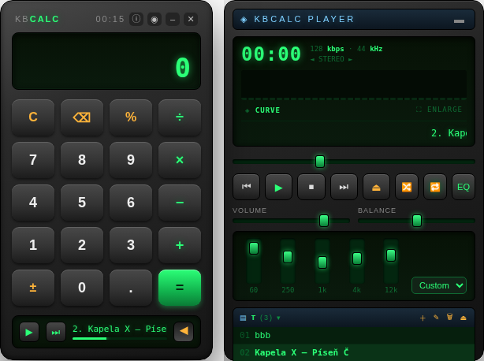

# kbCalc

*Čtete raději česky? → [README.cs.md](README.cs.md)*

A floating, translucent **calculator** with a built-in **Winamp-style MP3 player**.
Built on Electron — one codebase for **Linux, Windows and macOS**.


The window is frameless and translucent. At first glance it is just a calculator —
the `▶` arrow in the bottom bar expands a full music player next to it, complete
with a real-time visualizer.

## Features

**Calculator**
- Full mouse and keyboard input (digits, `+ - * /`, `Enter` = `=`, `Backspace`,
  `Esc`/`C` = clear, `.` or `,` as decimal separator).
- Green LCD display with thousands grouping.
- Behaves like the classic Windows *Standard* calculator on purpose:
  left-to-right evaluation (`2 + 3 × 4 = 20`) and context-aware percent
  (`200 + 10 % = 220`, `200 × 10 % = 20`).
- The window always resizes to exactly fit its content — collapsed, it is
  *only* the calculator, with a mini play/next control in the bottom bar.
- **Mini notepad** (`✎`): a small auto-saved scratchpad right under the
  calculator — the `⤓` chip inserts the current result at the cursor.
- **Calculation history** (`≣`): the last 50 results with their expressions;
  click an entry to continue calculating with it. Persisted, clearable.

**Player**
- Transport controls (prev / play–pause / stop / next / eject-to-add-files),
  plus **shuffle** and **repeat** (off / all / one) — both remembered.
- **Hardware media keys** work even when the app is in the background
  (play/pause, next, previous, stop).
- **Tray icon**: show/hide the window, playback controls, quit.
- VOLUME and BALANCE sliders backed by Web Audio, plus a **5-band equalizer**
  (60 Hz – 12 kHz, presets: Flat/Rock/Pop/Jazz/Bass+/Vocal, remembered).
- **ID3 tags**: tracks display "Artist – Title" read from ID3v2/ID3v1
  (dependency-free parser); falls back to the file name.
- **Podcasts** (`📡`): paste an RSS feed URL and the episodes become a new
  playlist, streamed on demand (with seeking); the visualizer and equalizer
  work on podcasts too. Playback position is remembered like for files.

  
- **Multiple named playlists**: create, inline-rename, delete, switch from the
  header dropdown. Playlists persist across restarts (file paths are stored;
  audio is lazy-loaded so at most one track is held in memory).
- **Drag & drop**: drop files to add them to the current playlist; drop a
  folder to create a new playlist named after it (recursive scan, audio files
  only, sorted). Reorder tracks by dragging them within the playlist.
- Dead/missing files are skipped automatically during playback.
- Supported formats: mp3, m4a, ogg/oga, wav, flac, aac, opus, wma
  (whatever the OS media stack can decode).

**Visualizer**
- 6 styles — the default **CURVE** is a smooth filled spectrum with a soft
  reflection (for fans of AIMP-style analyzers), plus SPECTRUM, MIRROR,
  BLOCKS, WAVE and TUNNEL. Click the canvas or the style button to cycle;
  the choice is remembered.
- Fullscreen mode (`⛶`): click to change style, `Esc` to leave.

**Window**
- Always-on-top toggle (`◉`), minimize, close — all custom, no OS title bar.
- Window position is remembered across restarts.
- About dialog (`ⓘ`) with project links and the app version. Once a day the app
  anonymously asks the GitHub Releases API whether a newer version exists and
  offers a link to the release notes — no telemetry, nothing is ever uploaded.

  

> The UI speaks **Czech and English** — it follows the system language and can be switched in the About dialog.

## Install

Grab an installer from the [Releases](../../releases) page:

| OS | Package |
|---|---|
| Windows | NSIS installer (`kbCalc Setup x.y.z.exe`) or portable `.exe` |
| Linux | `.AppImage` or `.deb` (x64) |
| macOS | `.dmg` / `.zip` (Apple Silicon) |

Builds are currently **unsigned**, so Windows SmartScreen and macOS Gatekeeper
will warn on first launch (Windows: *More info → Run anyway*).

## Development

```bash
npm install
npm start
```

## Building installers

```bash
npm run dist          # current OS
npm run dist:linux    # AppImage + deb
npm run dist:win      # NSIS installer + portable exe
npm run dist:mac      # dmg + zip
```

Installers land in `dist/`. CI (`.github/workflows/build.yml`) builds all three
OSes on their own runners; pushing a `v*` tag creates a GitHub Release with the
packages attached.

## Platform notes

- On **Linux**, hardware acceleration is disabled (works around a GPU-process
  crash with transparent frameless windows); Windows/macOS keep it on for a
  smoother visualizer.
- The `--no-sandbox` flag is applied on Linux only.

## Security model

The app follows Electron hardening practice:

- Renderer runs with `contextIsolation: true`, `nodeIntegration: false`.
- The preload bridge exposes a minimal API: window controls plus two
  file-system calls used by playlists. `fs:read` only serves real audio files
  (extension allow-list, symlinks resolved, regular files only) and
  `fs:expand` never follows symlinks and caps recursion depth.
- A restrictive CSP is set (`connect-src 'self'`, no `unsafe-inline`; media
  only via `blob:` and the app's own `kbaudio:` scheme). The renderer has **no
  direct network access** — it cannot open sockets or `fetch()` remote hosts.
- Navigation and `window.open` are denied in the main process. External links
  from the About dialog open in the system browser and only from a fixed
  allowlist keyed by name (the renderer passes a key, not a URL).
- The update check runs in the main process, at most once a day, and fails
  silently offline.
- **Podcasts** are the one place the renderer can trigger a network request,
  and only through two narrow main-process channels: fetching the RSS feed you
  paste, and streaming the episode you play (via a custom `kbaudio://` scheme).
  Both go through an **SSRF guard** — the target host is resolved and private /
  loopback / link-local ranges are refused, redirects are followed manually and
  every hop is re-checked, with a size cap and timeout. So a hostile feed cannot
  make the app probe `localhost` or your LAN, and the audio graph stays
  un-tainted so the visualizer and equalizer work on podcasts too.
- No dangerous permissions: the app denies all permission requests
  (microphone, camera, notifications, …) — it needs none.

Found a vulnerability? See [SECURITY.md](SECURITY.md).

## Authors

**Richard Pobrislo** and **Claude Fable 5** (Anthropic) — from the makers of
[killBottleneck](https://killbottleneck.com). Tutorials, news and AI
experiments on YouTube: [@ctrlaltaicz](https://www.youtube.com/@ctrlaltaicz).

## Contributing

See [CONTRIBUTING.md](CONTRIBUTING.md) — code layout, ground rules and how to
run from source.

## License

[MIT](LICENSE) © 2026 Richard Pobrislo
